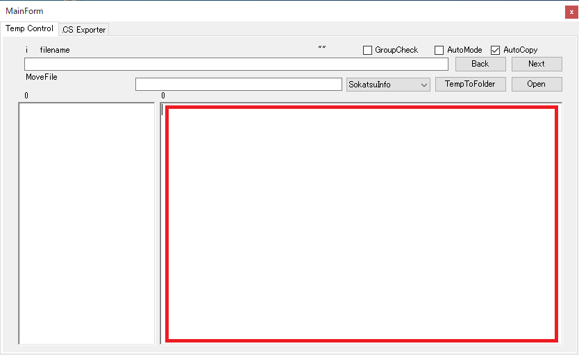
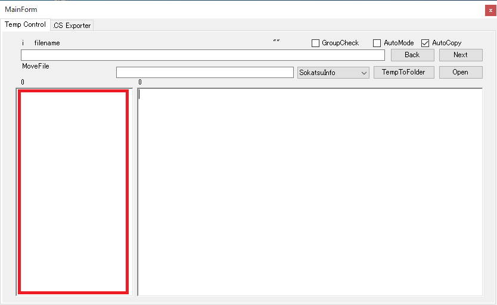
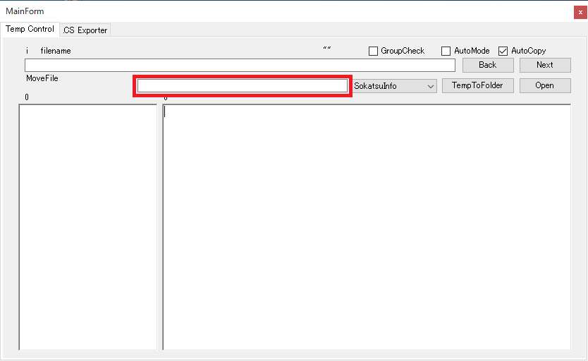
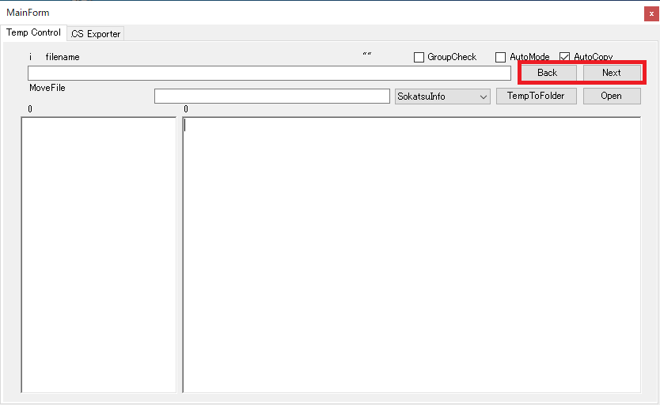
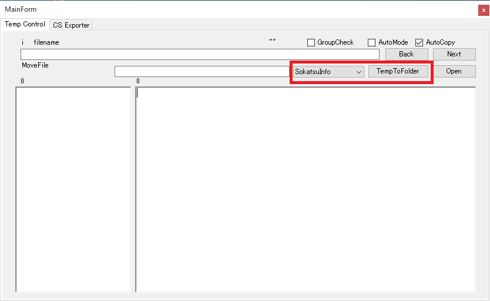
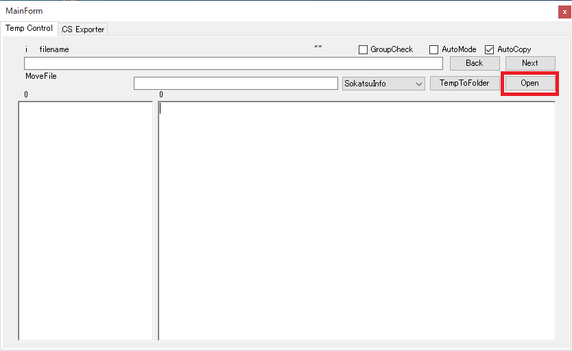
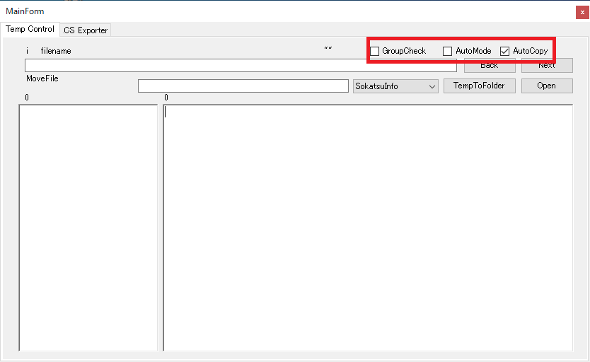

# MyToolBox

### This tool is develped for my daily job need.

#### [Download Here](https://github.com/Monojue/MyToolBox/raw/main/PDFtoText/bin/MyToolBox.zip)

1.  Insert file link here.

    

2.  Insert your custom name here. 
    If you leave BLANK, original file name will be use.

    
    
3.  Insert folder directory you want to move file.

    

4.  Next and Back button for choose file link.

    

5.  Choose type of file form dropdownlist. 
    TempToFolder will be move the file from Temp folder to your custom folder.
    
    

6.  Open your current file.

    

7.  "GroupCheck" is checked - automically search is there group file. 
    "AutoMode" is checked - when click the TempToFolder button, move file and select next link automically. 
    "AutoCopy" is checked - when Next and Back button is click link will automically copy to clipboard. 

    
